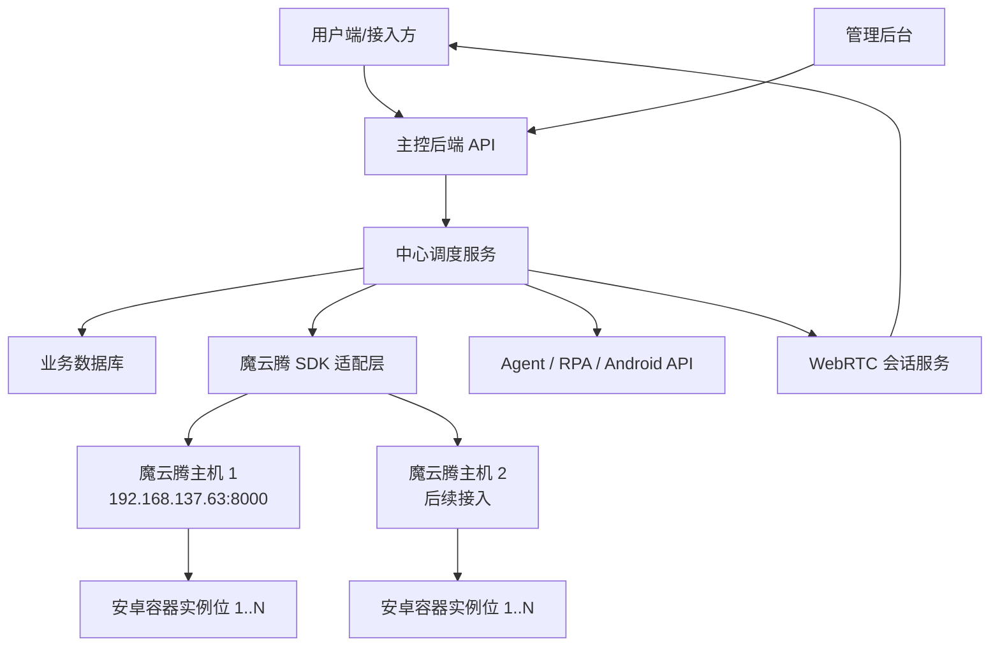
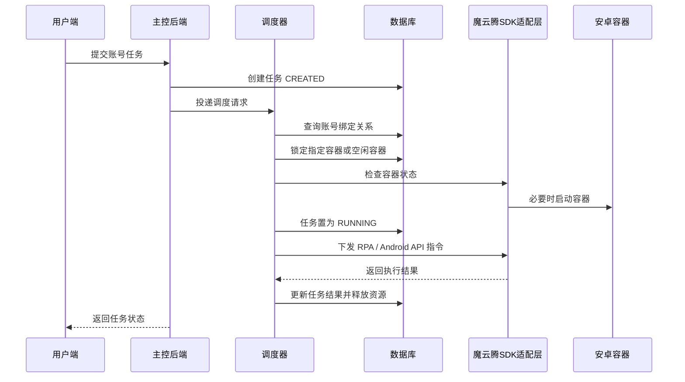
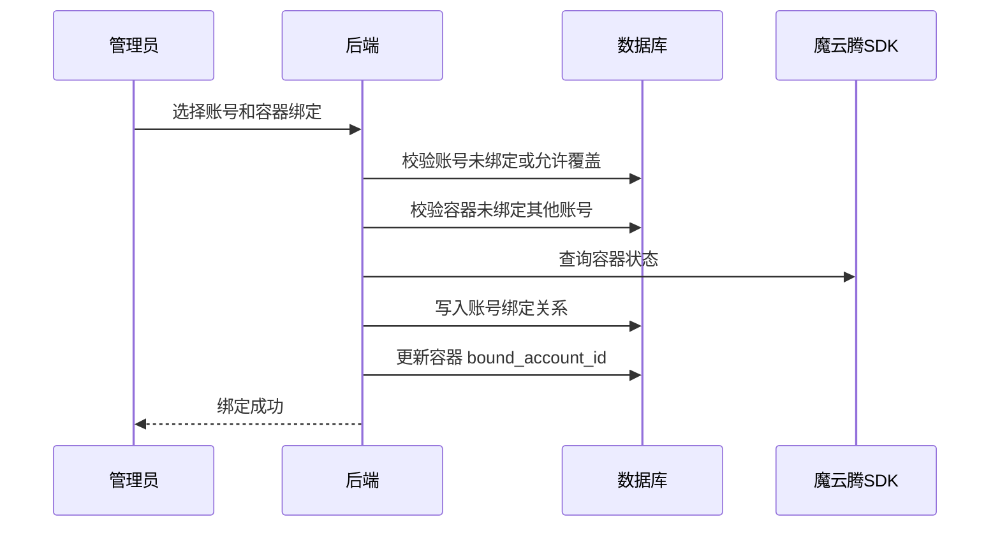
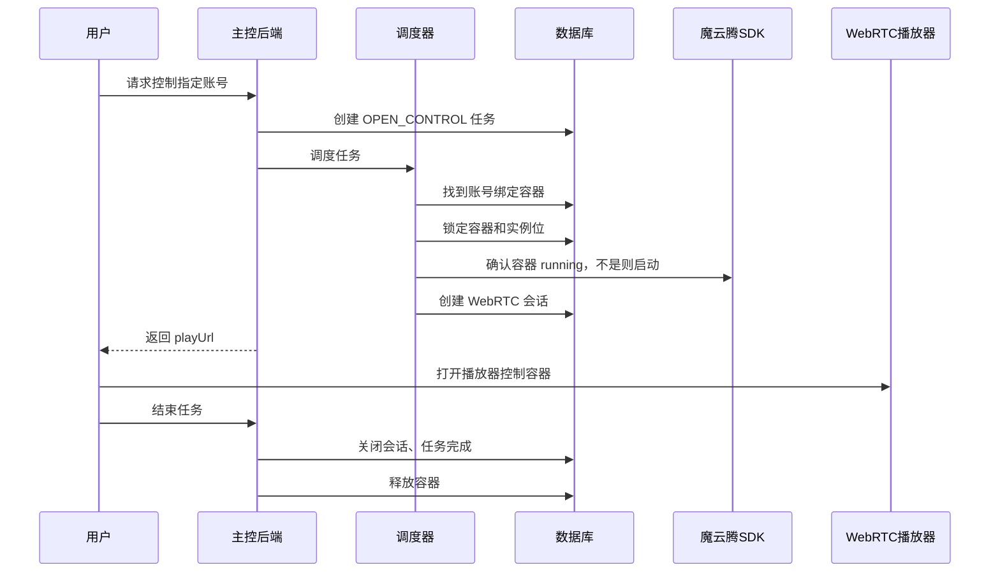

# 魔云腾云机容器调度管理系统设计文档

## 1. 背景与目标

当前业务角色不是单纯“购买云机并分配给用户”，而是作为云机能力提供方，统一管理魔云腾主机、安卓容器实例位、账号资源和用户任务。用户侧提交账号登录、账号操作、人工接管等请求后，主控后端负责任务编排，将任务调度到指定 `instance_id` / 容器实例位，再通过魔云腾 SDK API、RPA、Android API、WebRTC 等能力完成执行和画面控制。

核心目标：

- 管理多台魔云腾主机，例如云机 1、云机 2，每台云机包含多个安卓容器实例位。
- 管理容器实例位资源池，每个实例位同一时间只允许执行一个任务。
- 管理账号与容器绑定关系，一个账号可绑定一个稳定的 `instance_id`。
- 用户提交任务后，系统根据账号绑定、容器状态和任务类型进行调度。
- 后端通过魔云腾盒子内 SDK API 调用主机能力，完成容器启动、停止、状态同步、RPA 指令、WebRTC 地址生成等操作。
- 用户可通过 WebRTC 控制被授权任务对应的指定容器。

合规要求：

- 系统只设计资源管理、任务调度、授权控制和审计能力。
- 不设计绕过平台风控、批量垃圾行为、盗号撞库、异常营销等能力。
- QQ 或其他账号相关操作必须遵守目标平台、魔云腾以及公司内部规范。

## 2. 当前接入情况

已确认魔云腾主机：

| 配置项 | 当前值 |
| --- | --- |
| 主机 IP | `192.168.137.63` |
| SDK API 地址 | `http://192.168.137.63:8000` |
| API 连通性 | 已连通 |
| `/info` 当前版本 | `currentVersion = 102` |
| `/info` 最新版本 | `latestVersion = 155` |
| `/android` 当前容器数 | 4 |

当前读取到的容器示例：

| 容器名 | 状态 | 实例位 | 容器 IP | WebRTC TCP | WebRTC UDP |
| --- | --- | --- | --- | --- | --- |
| `r1-1-1` | running | 1 | `10.6.157.3` | `30007` | `30008` |
| `r1-1-2` | created | 1 | 空 | `30007` | `30008` |
| `r1-2-1` | created | 2 | 空 | `30107` | `30108` |
| `r1-2-2` | running | 2 | `10.6.157.2` | `30107` | `30108` |

说明：

- 魔云腾文档中盒子内 SDK API 的基础地址为 `http://{主机IP}:8000`，接口统一返回 JSON。
- 安卓容器列表接口为 `GET /android`，返回 `id`、`name`、`status`、`indexNum`、`ip`、`portBindings` 等字段。
- WebRTC 非桥接模式端口可按实例位计算：TCP = `30000 + (index - 1) * 100 + 7`，UDP = `30000 + (index - 1) * 100 + 8`。当前 `/android` 返回的 `portBindings` 也能直接取到 10008/tcp、10008/udp 对应宿主机端口。

参考文档：

- [魔云腾盒子内 SDK API 开发文档](https://dev.moyunteng.com/docs/NewMYTOS/heziSDKAPI)
- [魔云腾 Android WebRTC 投屏开发文档](https://dev.moyunteng.com/docs/NewMYTOS/MYT_ANDROID_webrtctouping)

## 3. 总体架构



核心组件：

- 主控后端：当前若依 Java 后端，负责用户、权限、账号、任务、调度、审计。
- 管理后台：当前若依 Vue3 前端，供管理员管理主机、容器、账号、任务。
- 魔云腾 SDK 适配层：封装 `http://{host}:8000` 的 SDK API，屏蔽具体接口差异。
- 中心调度服务：处理任务排队、资源锁定、账号绑定、容器选择、失败重试、释放资源。
- WebRTC 会话服务：根据容器实例位生成 WebRTC 播放/控制地址，并控制用户访问权限。
- Agent/RPA 执行层：在指定容器上执行登录、点击、输入、截图、命令等动作。

## 4. 资源模型

### 4.1 资源层级

```text
云机主机 Host
  └── 安卓容器 Container / Instance
        └── 实例位 Slot / indexNum
              └── 任务 Task
                    └── 账号 Account
```

定义：

- 云机主机：一台魔云腾盒子或服务器，例如 `192.168.137.63`。
- 容器实例：主机上的安卓容器，魔云腾 `/android` 返回的 `id` / `name`。
- 实例位：容器所在位置，使用 `indexNum` 表示。每个实例位同一时间只允许一个任务执行。
- 账号：业务账号，例如 QQ 账号。账号可绑定固定容器或固定实例位。
- 任务：用户发起的一次操作请求，例如登录账号、人工接管、执行 RPA 流程。

### 4.2 调度原则

- 优先使用账号绑定的容器：如果账号已绑定 `container_id` 或 `instance_id`，任务必须回到绑定容器执行。
- 未绑定账号可分配空闲容器：系统从资源池中选择健康、空闲、可用的容器。
- 实例位互斥：同一主机同一 `indexNum` 同时只能有一个运行中任务锁定。
- 容器互斥：同一容器同一时间只允许一个任务处于 `RUNNING` 或 `CONTROLLING`。
- 任务结束释放资源：任务完成、失败、取消、超时后释放容器锁。
- 人工接管优先级高于自动任务：用户进入 WebRTC 控制时，自动 RPA 应暂停或进入受控模式。

## 5. 角色与权限

| 角色 | 职责 |
| --- | --- |
| 超级管理员 | 管理所有主机、容器、账号、任务、配置和日志 |
| 云机运营 | 维护主机容器、查看任务、处理异常、手动释放资源 |
| 账号运营 | 导入账号、绑定容器、查看账号任务 |
| 接入用户 | 提交账号操作任务，查看自己的任务和 WebRTC 控制入口 |
| 外部系统 | 通过开放 API 提交任务、查询任务状态、获取控制会话 |

建议菜单：

| 菜单 | 路由 | 权限标识 |
| --- | --- | --- |
| 主机管理 | `/cloud/host` | `cloud:host:list` |
| 容器资源池 | `/cloud/container` | `cloud:container:list` |
| 账号管理 | `/cloud/account` | `cloud:account:list` |
| 任务调度 | `/cloud/task` | `cloud:task:list` |
| 调度看板 | `/cloud/scheduler` | `cloud:scheduler:view` |
| WebRTC 会话 | `/cloud/session` | `cloud:session:list` |
| SDK 调用日志 | `/cloud/sdk-log` | `cloud:sdklog:list` |
| 接入配置 | `/cloud/openapi` | `cloud:openapi:list` |

关键按钮权限：

- `cloud:host:add/edit/remove/sync`
- `cloud:container:sync/start/stop/restart/lock/release`
- `cloud:account:add/edit/import/bind/unbind`
- `cloud:task:create/cancel/retry/dispatch/finish`
- `cloud:session:create/close`
- `cloud:openapi:key`

## 6. 功能设计

### 6.1 主机管理

用于管理魔云腾主机设备。

字段：

- 主机名称、主机 IP、SDK 端口、API Base URL、设备 ID、型号、SDK 当前版本、SDK 最新版本。
- 在线状态、CPU 温度、负载、内存、磁盘、运行时长。
- 容器容量、已纳管容器数、运行容器数、异常容器数。
- 备注、启用状态、最近同步时间。

操作：

- 新增主机、编辑主机、停用主机。
- 测试连接：调用 `GET /info`。
- 同步设备信息：调用 `GET /info/device`。
- 同步 Agent 信息：调用 `GET /info/agent`。
- 同步容器列表：调用 `GET /android`。

默认配置：

- 当前默认主机：`192.168.137.63:8000`。
- 主机 API 超时建议 5 秒。
- 主机同步失败不影响系统登录，只标记主机异常。

### 6.2 容器资源池

用于管理每台主机下的安卓容器和实例位。

字段：

- 容器 ID、容器名称、主机 ID、主机 IP、实例位 `indexNum`。
- 容器状态：created、running、stopped、error、unknown。
- 调度状态：IDLE、LOCKED、RUNNING、CONTROLLING、COOLDOWN、DISABLED。
- 容器 IP、网络模式、镜像、分辨率、DPI、DNS。
- WebRTC TCP/UDP 端口、ADB 端口、RPA 端口。
- 当前任务 ID、绑定账号 ID、锁定过期时间、最近心跳时间。

操作：

- 同步容器：从 `/android` 拉取容器列表并更新本地资源池。
- 启动容器：调用 `POST /android/start`。
- 停止容器：调用 `POST /android/stop`。
- 重启容器：调用 `POST /android/restart`。
- 手动锁定/释放：处理异常任务或人工维护。
- 查看容器详情：展示端口映射、运行状态、绑定账号、最近任务。

调度状态说明：

| 状态 | 说明 |
| --- | --- |
| IDLE | 空闲，可接任务 |
| LOCKED | 已被调度器短暂锁定，准备执行任务 |
| RUNNING | 自动任务执行中 |
| CONTROLLING | 用户 WebRTC 人工控制中 |
| COOLDOWN | 任务结束后的冷却期 |
| DISABLED | 管理员停用，不参与调度 |

### 6.3 账号管理

账号是任务和容器绑定的核心。

字段：

- 账号 ID、账号类型、账号、昵称、所属用户、账号状态。
- 绑定主机 ID、绑定容器 ID、绑定实例位、绑定时间。
- 最近登录时间、最近任务时间、失败次数、风控备注。
- 凭证字段需要加密存储，前端不展示明文。

操作：

- 新增账号、批量导入账号、编辑账号、停用账号。
- 绑定容器：将账号固定绑定到指定容器或实例位。
- 解绑容器：释放绑定关系。
- 查看账号任务历史。

绑定规则：

- 一个账号默认只能绑定一个容器实例。
- 一个容器默认只能绑定一个长期账号。
- 如果业务允许临时账号池，可配置为“不固定绑定”，由调度器动态分配空闲容器。
- 账号绑定容器后，后续该账号相关任务优先回到同一容器执行，避免环境频繁变化。

### 6.4 用户任务

用户端或外部系统提交任务，主控端负责调度和执行。

任务类型建议：

| 类型 | 说明 |
| --- | --- |
| LOGIN_ACCOUNT | 登录指定账号 |
| OPEN_CONTROL | 打开 WebRTC 人工控制 |
| RPA_FLOW | 执行指定 RPA 流程 |
| ANDROID_COMMAND | 执行 Android API 或 shell 命令 |
| SCREENSHOT | 获取截图 |
| RELEASE_CONTAINER | 关闭任务并释放资源 |

任务状态：

| 状态 | 说明 |
| --- | --- |
| CREATED | 已创建 |
| QUEUED | 排队中 |
| DISPATCHING | 调度中 |
| RUNNING | 执行中 |
| WAIT_USER | 等待用户控制或确认 |
| CONTROLLING | 用户控制中 |
| SUCCESS | 成功 |
| FAILED | 失败 |
| CANCELED | 已取消 |
| TIMEOUT | 超时 |
| RELEASED | 已释放 |

任务字段：

- 任务编号、任务类型、提交用户、账号 ID、目标容器 ID、目标实例位。
- 优先级、任务参数、执行结果、失败原因。
- 锁定时间、开始时间、结束时间、超时时间。
- WebRTC 会话 ID、RPA 流程 ID、重试次数。

### 6.5 中心调度

调度流程：



调度算法：

1. 根据 `account_id` 查账号绑定容器。
2. 如果已绑定容器，校验容器在线、未锁定、未禁用。
3. 如果未绑定容器，从同一主机或全局资源池选择 `IDLE` 容器。
4. 使用数据库事务或 Redis 分布式锁锁定容器，锁键建议：`cloud:container:lock:{containerId}`。
5. 如果容器未运行，调用魔云腾 `POST /android/start` 启动。
6. 写入任务与容器绑定，任务进入 `RUNNING`。
7. 执行 RPA、Android API 或生成 WebRTC 会话。
8. 任务完成后释放锁，容器进入 `COOLDOWN`，冷却后恢复 `IDLE`。

并发要求：

- 同一容器同一时间只能有一个有效任务。
- 同一实例位同一时间只能有一个有效任务。
- 同一账号同一时间只能有一个运行中任务。
- 调度器必须支持任务幂等，重复请求不能重复锁定资源。

### 6.6 WebRTC 用户控制

用户需要人工操作指定账号时，后端给用户创建短期 WebRTC 会话。

WebRTC 地址生成：

- 桥接模式：端口固定为 `10008`。
- 非桥接模式：优先使用 `/android` 返回的 `portBindings["10008/tcp"]` 和 `portBindings["10008/udp"]`。
- 如果接口未返回端口，则按实例位计算：
  - TCP = `30000 + (indexNum - 1) * 100 + 7`
  - UDP = `30000 + (indexNum - 1) * 100 + 8`

播放器地址模板：

```text
webplayer/play.html?shost={hostIp}&sport={tcpPort}&q=1&v=h264&rtc_i={hostIp}&rtc_p={udpPort}
```

会话规则：

- 创建会话前必须校验任务归属、账号归属和容器锁定状态。
- 会话有效期建议 10 至 30 分钟，可按任务续期。
- 会话期间容器状态为 `CONTROLLING`，自动 RPA 暂停或禁止并发执行。
- 用户结束操作后调用关闭任务接口，后端关闭会话并释放容器。
- 后端不直接暴露主机管理接口，只返回经过授权的播放地址和会话令牌。

### 6.7 RPA / Android API 调度

执行层可分三种能力：

- 魔云腾盒子内 SDK API：主机、容器、镜像、网络、服务、RPA 等接口。
- Android API：面向容器内系统能力，例如点击、输入、截图、安装应用等。
- Agent：自研执行代理，承接复杂业务流程、状态回调和任务心跳。

建议所有执行动作都抽象为统一指令：

```json
{
  "taskId": 10001,
  "containerId": 20001,
  "accountId": 30001,
  "commandType": "RPA_FLOW",
  "payload": {
    "flowCode": "qq_login",
    "params": {}
  }
}
```

执行结果：

```json
{
  "taskId": 10001,
  "success": true,
  "status": "SUCCESS",
  "message": "ok",
  "data": {}
}
```

## 7. 数据库设计

### 7.1 主机表 `cloud_host`

| 字段 | 类型 | 说明 |
| --- | --- | --- |
| `host_id` | bigint | 主键 |
| `host_name` | varchar(100) | 主机名称 |
| `host_ip` | varchar(64) | 主机 IP |
| `api_port` | int | SDK API 端口，默认 8000 |
| `api_base_url` | varchar(255) | API 地址 |
| `device_id` | varchar(100) | 设备 ID |
| `model` | varchar(50) | 设备型号 |
| `current_version` | int | 当前 SDK 版本 |
| `latest_version` | int | 最新 SDK 版本 |
| `online_status` | varchar(20) | 在线状态 |
| `enabled` | char(1) | 是否启用 |
| `container_capacity` | int | 容器容量 |
| `last_sync_time` | datetime | 最近同步时间 |
| `remark` | varchar(500) | 备注 |
| `create_by/create_time/update_by/update_time` | 若依通用字段 | 审计字段 |
| `del_flag` | char(1) | 删除标志 |

### 7.2 容器实例表 `cloud_container`

| 字段 | 类型 | 说明 |
| --- | --- | --- |
| `container_id` | bigint | 主键 |
| `host_id` | bigint | 主机 ID |
| `provider_container_id` | varchar(128) | 魔云腾返回的容器 ID |
| `container_name` | varchar(100) | 容器名称 |
| `instance_id` | varchar(100) | 业务实例 ID，可与容器 ID 或名称映射 |
| `index_num` | int | 实例位 |
| `container_status` | varchar(30) | 魔云腾容器状态 |
| `schedule_status` | varchar(30) | 调度状态 |
| `android_type` | varchar(20) | 安卓类型 |
| `container_ip` | varchar(64) | 容器 IP |
| `network_name` | varchar(100) | 网络名称 |
| `image` | varchar(255) | 镜像 |
| `width/height/dpi` | int | 分辨率与 DPI |
| `webrtc_tcp_port` | int | WebRTC TCP 端口 |
| `webrtc_udp_port` | int | WebRTC UDP 端口 |
| `adb_port` | int | ADB 端口 |
| `current_task_id` | bigint | 当前任务 |
| `bound_account_id` | bigint | 绑定账号 |
| `lock_owner` | varchar(100) | 锁持有者 |
| `lock_expire_time` | datetime | 锁过期时间 |
| `last_heartbeat_time` | datetime | 最近心跳 |
| `raw_json` | text | SDK 原始返回 |
| `remark` | varchar(500) | 备注 |
| `create_by/create_time/update_by/update_time` | 若依通用字段 | 审计字段 |
| `del_flag` | char(1) | 删除标志 |

唯一约束：

- `host_id + provider_container_id`
- `host_id + container_name`
- `host_id + index_num + container_name` 可按实际命名规则调整

### 7.3 账号表 `cloud_account`

| 字段 | 类型 | 说明 |
| --- | --- | --- |
| `account_id` | bigint | 主键 |
| `account_type` | varchar(30) | 账号类型，如 QQ |
| `account_no` | varchar(100) | 账号 |
| `account_secret` | varchar(500) | 加密凭证 |
| `owner_user_id` | bigint | 所属用户 |
| `account_status` | varchar(30) | 可用、禁用、异常 |
| `bind_mode` | varchar(30) | FIXED、DYNAMIC |
| `host_id` | bigint | 绑定主机 |
| `container_id` | bigint | 绑定容器 |
| `instance_id` | varchar(100) | 绑定实例 ID |
| `last_login_time` | datetime | 最近登录 |
| `last_task_time` | datetime | 最近任务 |
| `fail_count` | int | 失败次数 |
| `risk_remark` | varchar(500) | 风控备注 |
| `create_by/create_time/update_by/update_time` | 若依通用字段 | 审计字段 |
| `del_flag` | char(1) | 删除标志 |

### 7.4 任务表 `cloud_task`

| 字段 | 类型 | 说明 |
| --- | --- | --- |
| `task_id` | bigint | 主键 |
| `task_no` | varchar(64) | 任务编号 |
| `task_type` | varchar(50) | 任务类型 |
| `task_status` | varchar(30) | 任务状态 |
| `submit_user_id` | bigint | 提交用户 |
| `account_id` | bigint | 账号 ID |
| `host_id` | bigint | 执行主机 |
| `container_id` | bigint | 执行容器 |
| `instance_id` | varchar(100) | 执行实例 |
| `priority` | int | 优先级 |
| `request_params` | text | 请求参数 JSON |
| `result_data` | text | 执行结果 JSON |
| `fail_reason` | varchar(1000) | 失败原因 |
| `retry_count` | int | 重试次数 |
| `timeout_seconds` | int | 超时时间 |
| `lock_time` | datetime | 锁定时间 |
| `start_time` | datetime | 开始时间 |
| `end_time` | datetime | 结束时间 |
| `create_by/create_time/update_by/update_time` | 若依通用字段 | 审计字段 |

索引：

- `task_no`
- `task_status + priority + create_time`
- `account_id + task_status`
- `container_id + task_status`

### 7.5 WebRTC 会话表 `cloud_webrtc_session`

| 字段 | 类型 | 说明 |
| --- | --- | --- |
| `session_id` | bigint | 主键 |
| `session_no` | varchar(64) | 会话编号 |
| `task_id` | bigint | 关联任务 |
| `user_id` | bigint | 使用用户 |
| `host_id` | bigint | 主机 |
| `container_id` | bigint | 容器 |
| `host_ip` | varchar(64) | 主机 IP |
| `tcp_port` | int | WebRTC TCP 端口 |
| `udp_port` | int | WebRTC UDP 端口 |
| `play_url` | varchar(1000) | 播放地址 |
| `session_status` | varchar(30) | ACTIVE、CLOSED、EXPIRED |
| `expire_time` | datetime | 过期时间 |
| `close_time` | datetime | 关闭时间 |
| `create_time/update_time` | datetime | 时间字段 |

### 7.6 SDK 调用日志表 `cloud_sdk_call_log`

| 字段 | 类型 | 说明 |
| --- | --- | --- |
| `log_id` | bigint | 主键 |
| `host_id` | bigint | 主机 |
| `task_id` | bigint | 任务 |
| `container_id` | bigint | 容器 |
| `api_path` | varchar(255) | SDK API 路径 |
| `http_method` | varchar(10) | 请求方式 |
| `request_body` | text | 请求摘要 |
| `response_body` | text | 响应摘要 |
| `result_code` | int | SDK 返回 code |
| `success` | char(1) | 是否成功 |
| `error_msg` | varchar(1000) | 错误 |
| `cost_ms` | int | 耗时 |
| `create_time` | datetime | 创建时间 |

## 8. 后端接口设计

接口前缀统一为 `/cloud`。

### 8.1 主机接口

| 方法 | 地址 | 说明 |
| --- | --- | --- |
| GET | `/cloud/host/list` | 主机分页列表 |
| POST | `/cloud/host` | 新增主机 |
| PUT | `/cloud/host` | 修改主机 |
| DELETE | `/cloud/host/{hostIds}` | 删除主机 |
| POST | `/cloud/host/{hostId}/test` | 测试 SDK 连接 |
| POST | `/cloud/host/{hostId}/syncInfo` | 同步 `/info`、`/info/device` |
| POST | `/cloud/host/{hostId}/syncContainers` | 同步 `/android` 容器 |

### 8.2 容器接口

| 方法 | 地址 | 说明 |
| --- | --- | --- |
| GET | `/cloud/container/list` | 容器列表 |
| GET | `/cloud/container/{containerId}` | 容器详情 |
| POST | `/cloud/container/{containerId}/start` | 启动容器 |
| POST | `/cloud/container/{containerId}/stop` | 停止容器 |
| POST | `/cloud/container/{containerId}/restart` | 重启容器 |
| POST | `/cloud/container/{containerId}/lock` | 手动锁定 |
| POST | `/cloud/container/{containerId}/release` | 手动释放 |

### 8.3 账号接口

| 方法 | 地址 | 说明 |
| --- | --- | --- |
| GET | `/cloud/account/list` | 账号列表 |
| POST | `/cloud/account` | 新增账号 |
| PUT | `/cloud/account` | 修改账号 |
| POST | `/cloud/account/importData` | 批量导入账号 |
| POST | `/cloud/account/{accountId}/bind` | 绑定容器 |
| POST | `/cloud/account/{accountId}/unbind` | 解绑容器 |
| GET | `/cloud/account/{accountId}/tasks` | 账号任务历史 |

### 8.4 任务接口

| 方法 | 地址 | 说明 |
| --- | --- | --- |
| GET | `/cloud/task/list` | 任务列表 |
| POST | `/cloud/task` | 创建任务 |
| GET | `/cloud/task/{taskId}` | 任务详情 |
| POST | `/cloud/task/{taskId}/dispatch` | 手动调度 |
| POST | `/cloud/task/{taskId}/cancel` | 取消任务 |
| POST | `/cloud/task/{taskId}/retry` | 重试任务 |
| POST | `/cloud/task/{taskId}/finish` | 完成任务并释放资源 |
| GET | `/cloud/task/{taskId}/logs` | 任务日志 |

创建任务请求示例：

```json
{
  "taskType": "OPEN_CONTROL",
  "accountId": 30001,
  "priority": 5,
  "timeoutSeconds": 1800,
  "params": {
    "scene": "manual_login"
  }
}
```

### 8.5 WebRTC 接口

| 方法 | 地址 | 说明 |
| --- | --- | --- |
| POST | `/cloud/webrtc/session` | 创建控制会话 |
| GET | `/cloud/webrtc/session/{sessionId}` | 会话详情 |
| POST | `/cloud/webrtc/session/{sessionId}/close` | 关闭会话 |
| GET | `/cloud/webrtc/session/{sessionId}/playUrl` | 获取播放地址 |

创建会话规则：

- 必须传入任务 ID 或账号 ID。
- 后端根据调度结果确定容器。
- 仅任务提交人或管理员可获取播放地址。
- 播放地址应短期有效。

### 8.6 对外接入接口

后续用户端或外部系统接入时建议单独使用 `/openapi` 前缀，并通过 AccessKey/签名认证。

| 方法 | 地址 | 说明 |
| --- | --- | --- |
| POST | `/openapi/tasks` | 创建任务 |
| GET | `/openapi/tasks/{taskNo}` | 查询任务状态 |
| POST | `/openapi/tasks/{taskNo}/control` | 申请人工控制 |
| POST | `/openapi/tasks/{taskNo}/close` | 关闭任务并释放资源 |

## 9. 魔云腾 SDK 适配层

后端不要在业务代码中直接拼魔云腾接口，应集中封装：

```java
public interface MoyuntengSdkClient {
    SdkInfo getInfo(CloudHost host);
    DeviceInfo getDeviceInfo(CloudHost host);
    AgentInfo getAgentInfo(CloudHost host);
    List<MytAndroidContainer> listAndroid(CloudHost host);
    void startAndroid(CloudHost host, String containerName);
    void stopAndroid(CloudHost host, String containerName);
    void restartAndroid(CloudHost host, String containerName);
    RpaResult executeRpa(CloudHost host, CloudContainer container, RpaCommand command);
}
```

实现要求：

- 统一处理 `code != 0` 的失败响应。
- 所有请求写入 `cloud_sdk_call_log`。
- 超时、连接失败、认证失败要转换为业务异常。
- 支持主机级别配置超时时间、认证信息。
- 敏感字段不写明文日志。

## 10. 前端页面设计

### 10.1 主机管理页

展示主机连接状态、SDK 版本、设备信息、容器统计。提供测试连接、同步信息、同步容器等操作。

### 10.2 容器资源池页

展示所有容器实例位的实时状态，重点展示：

- 主机、容器名、实例位、运行状态、调度状态。
- 绑定账号、当前任务、WebRTC 端口。
- 启动、停止、重启、锁定、释放、打开控制台。

建议提供看板视图：按主机分组，以实例位卡片展示 IDLE/RUNNING/CONTROLLING/ERROR 状态。

### 10.3 账号管理页

支持账号导入、绑定容器、解绑、查看账号状态、查看任务历史。

### 10.4 任务调度页

展示任务队列、任务状态、执行容器、失败原因、执行日志。支持取消、重试、手动调度、释放资源。

### 10.5 WebRTC 控制页

根据后端返回的 `playUrl` 打开播放器页面。用户只能看到任务对应容器，不能切换到其他容器。

## 11. 关键流程

### 11.1 账号绑定容器



### 11.2 用户人工控制账号



## 12. 定时任务与监控

建议定时任务：

| 任务 | 频率 | 说明 |
| --- | --- | --- |
| 主机在线检测 | 30 秒至 1 分钟 | 调用 `/info` |
| 容器状态同步 | 30 秒至 1 分钟 | 调用 `/android` |
| 任务超时扫描 | 10 秒至 30 秒 | 超时任务置为 TIMEOUT 并释放锁 |
| 锁过期扫描 | 10 秒至 30 秒 | 清理异常锁 |
| 会话过期扫描 | 1 分钟 | 关闭过期 WebRTC 会话 |

监控指标：

- 主机在线数量、离线数量。
- 容器总数、空闲数、运行数、控制中数量、异常数量。
- 任务排队数、运行数、成功率、失败率、平均耗时。
- SDK 调用成功率、平均耗时、超时次数。

## 13. 安全设计

- 管理后台使用若依 JWT 和菜单权限。
- 对外 API 使用 AccessKey + Secret + 时间戳 + 签名，防止重放。
- 用户只能访问自己的账号、任务、WebRTC 会话。
- WebRTC 播放地址必须和任务、用户、容器绑定，禁止长期公开。
- 容器启动、停止、重启、释放必须写审计日志。
- 账号凭证加密存储，日志脱敏。
- 主机 SDK API 不直接暴露给公网用户。
- 所有任务参数保存摘要，敏感字段脱敏。

## 14. 异常处理

| 场景 | 处理 |
| --- | --- |
| 主机离线 | 任务进入 QUEUED 或 FAILED，提示主机不可用 |
| 容器不存在 | 同步资源池后仍不存在则任务失败 |
| 容器被占用 | 任务排队或返回资源忙 |
| 账号未绑定容器 | 按动态分配规则选择空闲容器 |
| WebRTC 端口缺失 | 从 `indexNum` 计算端口，仍失败则提示无法生成会话 |
| SDK 返回非 0 | 记录 SDK 日志，任务失败或重试 |
| 任务超时 | 关闭会话，释放容器，记录 TIMEOUT |
| 用户异常断开 | 会话过期任务扫描自动释放资源 |

## 15. 开发步骤建议

第一阶段：资源纳管

- 新增主机、容器、账号、任务、会话、SDK 日志表。
- 接入 `192.168.137.63:8000`，完成 `/info`、`/info/device`、`/android` 同步。
- 完成主机管理、容器资源池、账号绑定页面。

第二阶段：基础调度

- 实现容器锁、实例位互斥、任务状态机。
- 实现账号绑定容器后，任务调度到指定容器。
- 实现容器启动、停止、重启。
- 实现任务完成、失败、超时释放资源。

第三阶段：WebRTC 控制

- 根据容器 `portBindings` 或 `indexNum` 生成 WebRTC 播放地址。
- 新增 WebRTC 会话表和会话权限校验。
- 用户可申请控制账号绑定容器，完成后关闭任务释放资源。

第四阶段：RPA / Android API

- 接入魔云腾 RPA 或 Android API。
- 抽象任务指令和执行结果。
- 支持账号登录、截图、输入、点击、流程执行等合规操作。

第五阶段：对外接入

- 提供 `/openapi` 任务创建、状态查询、申请控制、关闭任务接口。
- 增加 AccessKey 签名、限流、配额、调用日志。

## 16. 测试验收

资源纳管：

- 能成功连接 `192.168.137.63:8000`。
- 能同步 `/android` 返回的容器列表。
- 能正确解析容器 `id`、`name`、`status`、`indexNum`、WebRTC 端口。

调度：

- 同一容器不能同时执行两个任务。
- 同一账号不能同时执行两个任务。
- 账号绑定容器后，任务必须调度到绑定容器。
- 容器异常或被占用时，任务不会错误抢占资源。

WebRTC：

- running 容器可生成正确播放地址。
- 非任务归属用户不能访问会话。
- 关闭任务后，会话失效且容器释放。

SDK 调用：

- `/info`、`/android`、`/android/start`、`/android/stop`、`/android/restart` 均有调用日志。
- SDK 超时和失败能返回明确错误。

安全：

- 用户不能通过改 URL 操作其他账号或容器。
- 账号凭证不明文返回前端。
- SDK 主机地址不直接暴露为可任意调用入口。

